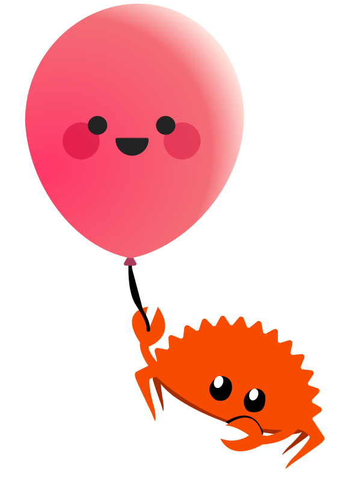

    

# Introduction

Rust Floating UI is a Rust port of [Floating UI](https://floating-ui.com/).

[Floating UI](https://floating-ui.com) is a library that helps you create “floating” elements such as tooltips, popovers, dropdowns, and more.

It provides a toolkit of positioning features that let you robustly anchor an absolutely-positioned floating element next to a given reference element. For example, a popover floats next to and remains anchored to its triggering button, even while the page scrolls.

It also provides features to avoid collisions with the viewport, as absolute positioning often leads to unwanted overflow depending on the location of the positioning reference.

## Frameworks

Rust Floating UI is available for the following frameworks:

-   [DOM (`web-sys`)](https://rustwasm.github.io/wasm-bindgen/web-sys/index.html)
-   [Leptos](https://leptos.dev/)
-   [Yew](https://yew.rs/)

The following frameworks are under consideration:

-   [Dioxus](https://dioxuslabs.com/)

See [Frameworks](./frameworks/index.md) for documentation for each framework.

## Examples

See [Examples](./examples.md).

## License

This project is available under the [MIT license](https://github.com/RustForWeb/floating-ui/blob/main/LICENSE.md).

## Rust For Web

The Rust Floating UI project is part of the [Rust For Web](https://github.com/RustForWeb).

[Rust For Web](https://github.com/RustForWeb) creates and ports web UI libraries for Rust. All projects are free and open source.
